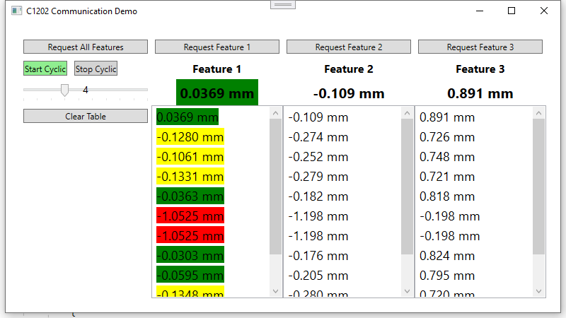

# Demo app for reading and evaluation Feature data with C1202 in Visual Code C#

## Development environment:
- MS Visual Studio 2019

## Language
- C#
- WPF

## features:
- automatic communication port discovery at startup
- Listen port for recieving feature values
- Value evaluation using regex:
    - single feature value
    - all features vallues
    - Tolernaces and Warning evaluation
- Request all features
- Request single feature
- Request all features cyclicly
- value history display in tables for each feature
- Clear history (table)

Getting started:
1. dwonload MS Visual Studio
2. clone repository
3. open solution
4. connect C1202 with DK-U1 calbe
5. compile and run program.
6. Modify for your needs

Software components:
- Library: **Services/C1202Com.cs**
- Model: **Model/FeatureValue.cs**
- Visualisation: **MainWindow.xlm, mainViewCtrl.cs, Folder Core/**

Library public methods:
- getPort() - gets DK-U1 port
- getAllMeasurements() - requests all features
- getFeature(int featureNo) - request one featue
- portListen() - open port for Listening replied values